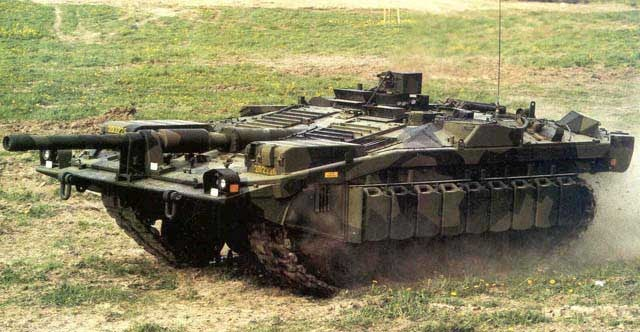

**Bugs conocidos:**

*   Tanques muertos mantienen su movimiento
*   La velocidad del tipo de tanque no afecta a como de rápido se mueve

**Características a aumentar/mejorar de la IA**

*   Los tanques nunca eligen girar
*   Los tanques utilizan en algunos casos la función aplicarImpactoDirecto en vez de dispararA (Daño telepático)
*   Los parámetros (Daño/Armadura/Munición...) de los tanques son desbalanceados.

Nota: <em> Nuestros tanques son actualmente de cañón fijo (sin torreta) y deberán apuntar en un futuro con su movimiento</em>

Ejemplo de tanque de cañón fijo "Stridsvagn 103":
